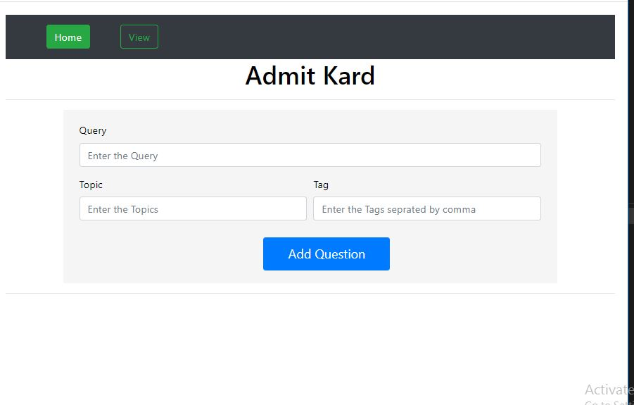
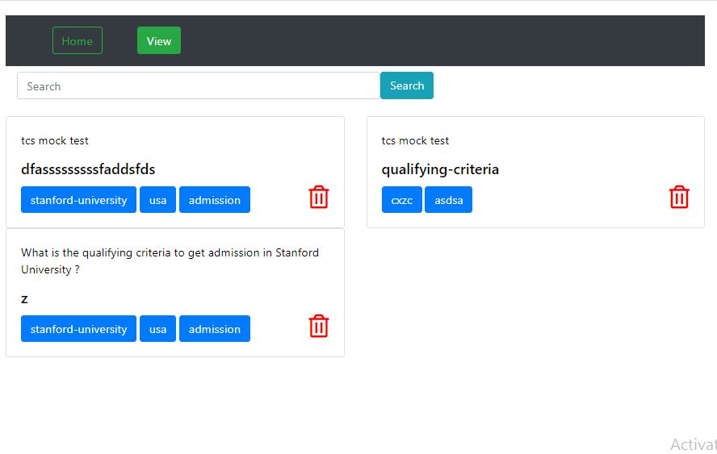

# AdmitKard-Question-Bank

Simple Question bank Application where user can add query, topic, tags and can search the question based on query or tags and can also delete the particular question.
This Application is made using NodeJs,ExpressJs,Mongodb,JavaScript,Html,Css,Bootstrap.
# Video Link
https://drive.google.com/file/d/1KBVm7RkGctS67Q1TwdhCOwdhUmC4xkUO/view

# Libraries Required:
     "ejs": "^3.1.3",
    "express": "^4.17.1",
    "express-ejs-layouts": "^2.5.0",
    "mongoose": "^5.9.18",
    "nodemon": "^2.0.4"
This data is directly acquired from package.json.

# Project Structure:
          
* assets: contains all static files like css, js. 
* config: Contains configuration js for mongoose . 
* models: Contains db collection . 
* controllers: Contains all the controller functions. 
* Routes: Contains all routes. 
* views: Contains all views. 

#Starting the Project:

* Download as zip and extract in your local system.
* Open folder in VS code
* Open terminal and make the project folder as your current directory
* Install all the libraries mentioned above.
* To start the server, use command: npm start
* Go to https://localhost/8000 on your browser to use the application.

# Home Page for Adding Questions 

# View Page

